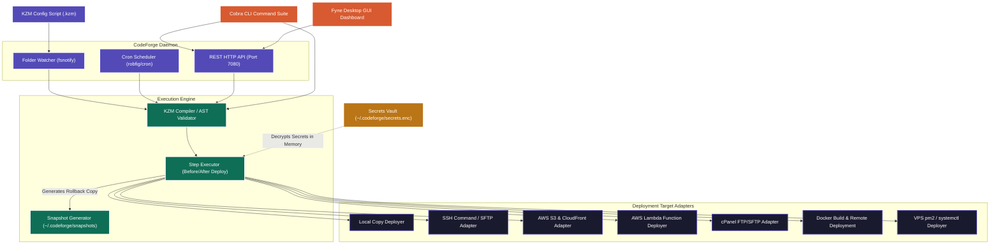

# CodeForge - Production-Ready CI/CD Daemon & GUI Dashboard

CodeForge is a complete, production-ready CI/CD daemon built in Go 1.22. It features its own configuration scripting language (**KZM**), a secure encrypted credentials vault, a REST API server, and a premium graphical desktop dashboard compiled into a single cross-platform executable.

* **Tagline**: CI/CD - v1.0.0
* **Author**: KhajumSanjog
* **Primary Accent Color**: #534AB7 (Purple)

---

## 1. System Architecture



---

## 2. Installation & Cross-Compilation

To compile CodeForge on your host machine, ensure you have Go 1.22+ installed.

### Build Commands

```bash
# Build the local system binary
make build

# Build arm64 Darwin target (macOS)
make build-mac-arm

# Build headless server binary (excludes GUI dependencies, CGO disabled)
CGO_ENABLED=0 go build -tags headless -ldflags="-s -w -X codeforge/cmd.Version=1.0.0" -o codeforge-headless .

# Run project unit tests
make test

# Cross-compile for macOS Intel (amd64)
make build-mac-intel

# Cross-compile for Windows (amd64)
make build-windows

# Run the test suite
make test

# Clean all compiled binaries
make clean
```

---

## 3. Platform Specific Setup

### macOS Instructions

1. **Prerequisites**: Ensure you have Xcode Command Line Tools installed for compiler header files:
   ```bash
   xcode-select --install
   ```
2. **Running the GUI**: Double-click the compiled `codeforge` binary or run it in your terminal session:
   ```bash
   ./codeforge
   ```
   *Note: On macOS, GUI apps must run in a graphical desktop session. Running it over headless ssh sessions will cause driver initialization failures.*
3. **Daemon**: Background process management generates a PID file automatically inside `~/.codeforge/daemon.pid`.

### Windows Instructions

1. **Prerequisites**: Ensure you have a GCC-compatible compiler (like MinGW-w64) installed and configured on your `PATH` for cgo support if compiling locally.
2. **Running the GUI**: Launch `codeforge.exe` from command line (PowerShell/CMD) or double-click to run:
   ```powershell
   .\codeforge.exe
   ```
3. **Daemon**: Background daemon executes via hidden flags automatically, writing log records to your user profile directory `AppData/Local/codeforge/` or `~/.codeforge/`.

---

## 4. KZM Configuration Scripting Language (.kzm)

KZM uses double-space indentation blocks to define pipelines:

```yaml
project "My Node App"
description "Node.js application deployed to remote VPS"

watch github "myuser/my-app" on branch "main"

before deploy:
  run "npm install"
  run "npm test" must pass

deploy to ssh "prod-server" at "/var/www/my-app":
  key "~/.ssh/deploy_key"
  restart "pm2 restart my-app"

keep last 5

notify slack "$secret.SLACK_WEBHOOK"
```

### Key Elements:
* **`must pass`**: Denotes a critical pipeline step. If this step fails, execution halts and initiates a rollback.
* **`must pass or rollback`**: Explicitly instructs the runner to restore the latest snapshot if the step returns a non-zero exit status.
* **`$secret.KEY`**: Safely interpolates decrypted values from your secure vault at runtime without printing them to any console or log file.

### AWS Credentials & IAM Role-Based Policies
For AWS S3 and AWS Lambda deployment targets, CodeForge supports two authentication modes:

1. **Option A: Static Credentials (Access Keys)**:
   Specify the keys in the deployment options (ideally stored in the Secrets vault):
   ```yaml
   deploy to s3 "my-s3-bucket":
     region "us-east-1"
     access_key "$secret.AWS_ACCESS_KEY_ID"
     secret_key "$secret.AWS_SECRET_ACCESS_KEY"
   ```

2. **Option B: Role-Based Policy (IAM Role)**:
   If `access_key` and `secret_key` are omitted from the target configuration, CodeForge automatically falls back to the standard AWS credential chain. This checks environment variables and queries EC2/ECS metadata servers for **IAM Instance Profiles** or **Task Roles**, allowing for secure, keyless authentication.

---

## 5. CLI Reference Guide

### Running and Verifying Pipelines
* **Launch graphical UI dashboard**:
  ```bash
  ./codeforge
  # or
  ./codeforge gui
  ```
* **Interactive pipeline creation wizard**:
  ```bash
  ./codeforge init
  ```
* **Verify syntax and targets of a `.kzm` file**:
  ```bash
  ./codeforge check path/to/project.kzm
  ```
* **Execute a pipeline once in the foreground**:
  ```bash
  ./codeforge run path/to/project.kzm
  ```

### Secrets Vault Management
* **Store a secret**:
  ```bash
  ./codeforge secrets set MY_API_KEY
  ```
* **List secret keys**:
  ```bash
  ./codeforge secrets list
  ```
* **Remove a secret**:
  ```bash
  ./codeforge secrets delete MY_API_KEY
  ```

### Background Daemon Management
* **Start the background queue & watchers**:
  ```bash
  ./codeforge daemon start
  ```
* **Check the daemon PID and active pipeline table**:
  ```bash
  ./codeforge status
  ```
* **Trigger a pipeline manual build**:
  ```bash
  ./codeforge trigger "My Node App"
  ```
* **Stop background daemon**:
  ```bash
  ./codeforge daemon stop
  ```
* **Show live tail logs**:
  ```bash
  ./codeforge logs "My Node App"
  ```
* **Manually trigger rollback to last snapshot**:
  ```bash
  ./codeforge rollback "My Node App"
  ```

---

## 6. Directory Structure
* `~/.codeforge/pipelines/` - Store registered pipeline `.kzm` files here for automatic daemon pick-up.
* `~/.codeforge/snapshots/` - Directory snapshots created prior to target deployment.
* `~/.codeforge/logs/` - JSON daily logger files.
* `~/.codeforge/secrets.enc` - Secure vault file.
* `~/.codeforge/master.key` - 256-bit master key created with `0600` permissions.

---

## License & Credits
* **Built by**: KhajumSanjog
* **Distributed under**: Production-Ready CI/CD standards.
