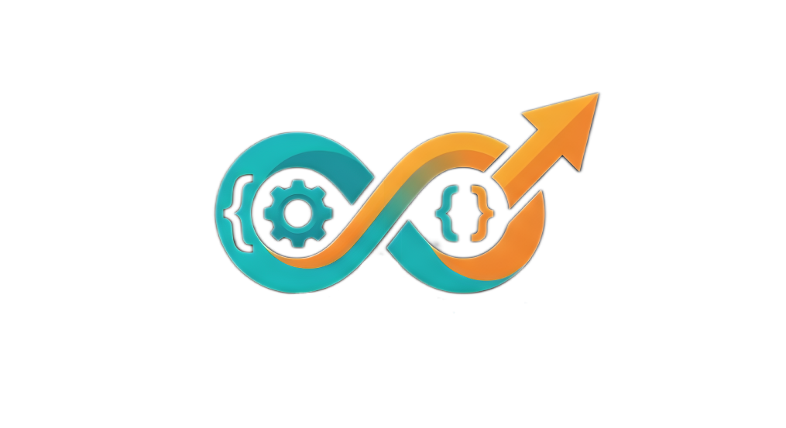

# ⚡ CodeForge

<p align="center">
  
</p>

<p align="center">
  <b>CI/CD Automation for Modern Developers</b><br/>
  Build • Test • Deploy • Monitor — All in one powerful DevOps engine
</p>

<p align="center">
  
  
  
</p>

---

## ✨ Overview

**CodeForge** is a next-generation DevOps automation platform designed to simplify and accelerate software delivery.

It provides a unified system for:

- CI/CD pipeline automation
- Git-based deployment triggers
- Multi-environment deployments
- Secure secrets management
- Rollback & snapshot system
- Real-time pipeline monitoring
- GUI + CLI + Daemon in a single binary

> Think of it as **GitHub Actions + Jenkins + Vercel + custom DevOps engine — all in one tool.**

---

## 🚀 Features

### ⚙️ CI/CD Engine
- GitHub / GitLab integration
- Folder-based watchers
- Scheduled deployments (cron support)
- Manual triggers via CLI or API

### 🧠 Smart Pipeline Language (KZM)
Human-readable deployment scripts:

```kzm
project "My API"

watch github "user/repo" on branch "main"

before deploy:
  run "npm install"
  run "npm test" must pass

deploy to ssh "ubuntu@server" at "/var/www/app":
  restart "pm2 restart app"


🔐 Secure Secrets Vault
AES-256-GCM encrypted storage
Master key protection
CLI-based secure management
codeforge secrets set AWS_KEY xxxx
codeforge secrets list
🔄 Rollback System
Automatic snapshot before deploy
One-click rollback
Safe failure recovery
📊 Real-Time Monitoring
Live logs streaming
Pipeline status dashboard
Success / failure analytics
Deployment history tracking
🖥️ Dual Interface
Powerful CLI for developers
Beautiful desktop GUI (Fyne)
System tray integration
Splash screen with branding
🏗️ Architecture
CodeForge/
 ├── CLI (Cobra)
 ├── Daemon (Background Engine)
 ├── GUI (Fyne Desktop App)
 ├── KZM Parser (Custom DSL)
 ├── Executors (Pipeline Engine)
 ├── Adapters (SSH, AWS, Docker, cPanel)
 ├── Secrets Vault (AES-256-GCM)
 ├── Logger (JSON logs)
 └── Rollback Engine
⚙️ Installation
🔧 Requirements
Go 1.22+
Git
Linux / Mac / Windows
📦 Build from source
git clone https://github.com/your-username/codeforge.git
cd codeforge

go mod tidy
go build -ldflags="-s -w" -o codeforge .
🚀 Install globally
sudo mv codeforge /usr/local/bin/
codeforge --version
🧪 Quick Start
1. Initialize a pipeline
codeforge init
2. Validate pipeline
codeforge check my-api.kzm
3. Run manually
codeforge run my-api.kzm
4. Start daemon
codeforge daemon start
📂 Configuration

All system data is stored in:

~/.codeforge/

Structure:

pipelines/     → .kzm files
logs/          → execution logs
snapshots/     → rollback data
secrets.enc    → encrypted secrets
master.key     → encryption key
daemon.pid     → running process
🔐 Secrets Management
codeforge secrets set GITHUB_TOKEN ghp_xxx
codeforge secrets set SLACK_WEBHOOK https://hooks.slack.com/...
codeforge secrets list

Secrets are never exposed in logs or UI

🔄 Deployment Targets

CodeForge supports multiple platforms:

SSH Servers
AWS Lambda
Docker Containers
cPanel Hosting
S3 Static Hosting
VPS / Local Systems
📡 Example Pipeline
project "Node API"

watch github "user/api" on branch "main"

before deploy:
  run "npm install"
  run "npm test" must pass

deploy to ssh "ubuntu@server" at "/var/www/api":
  restart "pm2 restart api"

notify slack "#deployments"
🖥️ CLI Commands
codeforge gui
codeforge init
codeforge check file.kzm
codeforge run file.kzm
codeforge daemon start
codeforge status
codeforge logs my-api --tail
codeforge trigger my-api
codeforge rollback my-api
🔔 Notifications
Slack integration
Email alerts
Deployment success/failure reports
🧠 Design Philosophy

CodeForge is built with:

Simplicity first
Developer experience focus
Zero configuration deployment
Production-grade safety
Observability by default
📈 Roadmap
 Web dashboard version
 Kubernetes adapter
 GitHub Actions import
 AI deployment suggestions
 Multi-region deployment
 Plugin marketplace
🧑‍💻 Author

KhajumSanjog

Built with ❤️ for developers who love automation.
